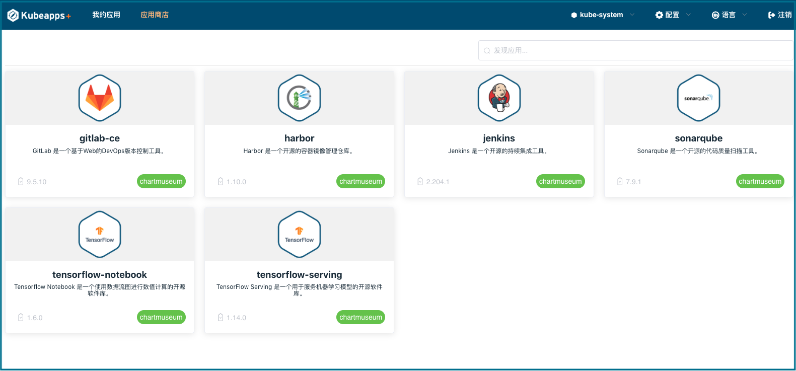

#  KubeApps Plus


KubeApps Plus 是 [KubeApps](https://github.com/kubeapps/kubeapps) 的定制版本，基于 Web UI 界面在 Kubernetes 集群中部署和管理基于 Helm Chart 的应用程序。[KubeApps](https://github.com/kubeapps/kubeapps) 是由 [Bitnami](https://bitnami.com/) 发布的 Kubernetes 应用商店，KubeApps Plus 当前的主要定制包括前端重写、中文支持和纯离线支持。KubeApps Plus 使用 Apache License 2.0 许可, 与 [KubeApps](https://github.com/kubeapps/kubeapps/blob/master/LICENSE) 相同。

KubeApps Plus 是 KubeOperator 内置的应用商店方案。基于应用商店，KubeOperator 可以满足各种常用的 K8s 应用场景，比如：

- CI / CD 应用场景：GitLab、Jenkins、Harbor、Sonarqube、ArgoCD 等；
- GPU / AI 应用场景：Tensorflow 等;
- Serverless 应用场景：Knative 等；
- 数据库应用场景：MySQL、Redis 等;


`注意：默认 Kubeapps-plus 应用商店里面是没有应用的，需要你自己上传使用，或者连接外部 helm 仓库。`
 

## 主要功能

- 从 Helm Chart 仓库中浏览并部署 Helm Chart 应用；
- 集群中已有 Helm chart 应用的查看、升级和卸载；
- 支持自定义 Helm Chart 仓库（比如 ChartMuseum 和 JFrog Artifactory 等）；
- 基于 Kubernetes RBAC 的身份验证和授权；

## 安装 KubeApps Plus

- 自动安装：KubeApps Plus 是 KubeOperator 的一个内置应用。通过 KubeOperator 部署的 K8s 集群会自动安装上 KubeApps Plus；
- 手动安装：使用如下脚本自行在已有 K8s 集群中安装。详情请参考： [KubeApps Plus 安装指南](chart/README.md)；

```bash
# 登录 K8s 集群的 master 节点
git clone https://github.com/KubeOperator/kubeapps-plus.git
cd kubeapps-plus
helm install --name kubeapps-plus --namespace kubeapps-plus ./chart
```

## 安装 Helm Charts 离线包

Helm Chart 离线包包括两个离线包，一个是 CI 相关的应用包括 Gitlab、Harbor、Jenkins 和 Sonarqube，另外一个是 AI 机器学习应用包括 Tensorflow-notebook 和 Tensorflow-serving，用户可以根据需要下载并安装。
请自行下载 Chart 离线包，并复制到目标机器的 /tmp 目录下。

- 下载链接: https://github.com/KubeOperator/KubeOperator/releases

默认使用本地 ChartMuseum 仓库，如果需要修改仓库地址，请修改 kubeappsctl.sh 文件里的 repo_url、repo_username、repo_password 等参数。
安装过程中需要手动输入的信息，选择默认值，即选择不使用外部 Docker Image registry 和不使用外部 Chart 仓库。

```bash
# 首先登录 master 节点，其次进入 tmp (或其他自定义)目录
cd /tmp
wget http://xxx.xxx.xxx.xxx/kubeapps-plus/kubeapps-plus-package-v1.0-CI-xx.tar.gz
# 解压文件到本目录
tar zxvf kubeapps-plus-package-v1.0-CI-xx.tar.gz
# 解压后会出现一个 kubeapps-plus-CI 目录
cd kubeapps-plus-CI
# 执行 kubeappsctl.sh shell 文件,将会下载镜像并推送到本地(或自定义)仓库
./kubeappsctl.sh start
```

## 使用 KubeApps Plus

- 具体请参考：[KubeApps Plus 使用指南](docs/user/getting-started.md)；

## KubeApps Plus 开发指南

- [Kubeapps Plus 架构说明](docs/architecture/overview.md)；
- [KubeApps Plus 构建指南](docs/developer/build.md)；
- [KubeApps Plus 开发文档](docs/developer/README.md)；

## 沟通交流
 
- 技术交流 QQ 群：825046920；
- 技术支持邮箱：support@fit2cloud.com；
- 微信群： 搜索微信号 wh_it0224，添加好友，备注（城市-github用户名）, 验证通过会加入群聊。
