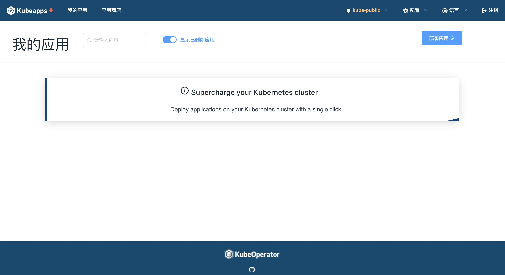

# 使用仪表板

[在群集中安装Kubeapps Plus](../../chart/kubeapps/README.md)之后，您可以使用仪表板开始在群集中管理和部署应用程序。 请查看[Getting Started](getting-started.md)指南，以了解如何访问仪表板和部署第一个应用程序。

以下各节将引导您完成Kubeapps Plus仪表板的一些常见任务。

## 使用图表

### 使用仪表板部署新应用程序

* 从仪表板欢迎页面开始：

  

* 使用“图表”菜单从官方Kubernetes图表存储库中的图表列表中选择一个应用程序。 本示例假定您要部署MariaDB。

  

* 单击“使用 Helm 部署”按钮。 系统将提示您输入发行名称，集群名称空间和应用程序部署的值。

* 点击“提交”按钮。 该应用程序将被部署。 您将能够直接从浏览器跟踪新的Kubernetes部署。 部署页面的“注释”部分包含帮助您使用该应用程序的重要信息。

  

### 列出集群中运行的所有应用程序

“应用程序”页面显示群集中由Helm管理的应用程序部署的列表。

### 删除现有的应用程序部署

您可以通过单击应用程序状态页面上的“删除”按钮来从集群中删除任何应用程序：

### 添加更多图表存储库

默认情况下，Kubeapps Plus带有启用的官方Kubernetes图表存储库。 您可以在“配置”菜单下的“应用程序存储库”页面中查看已启用的图表存储库的列表：

通过单击“添加应用程序存储库”按钮来添加新的存储库(例如，您组织的图表存储库)。 使用以下准则填写“添加存储库”表单：

* 名称：使用任何唯一标识符。
* URL：添加图表存储库的URL(与“ helm repo add”使用的URL相同)

