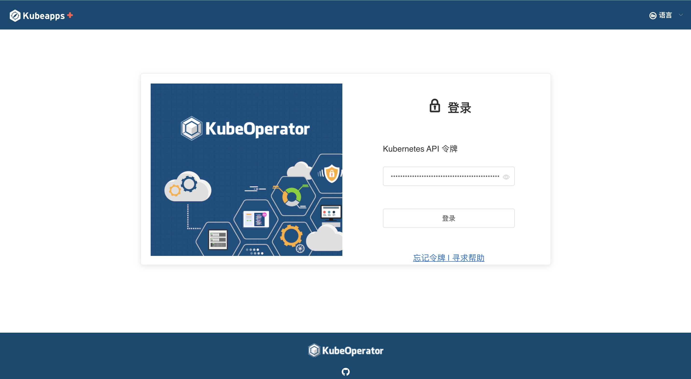
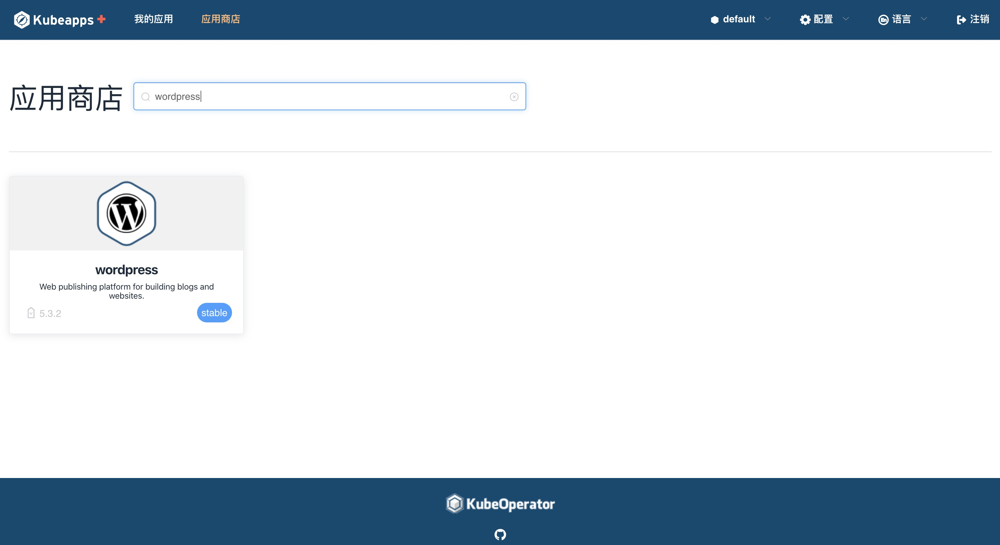
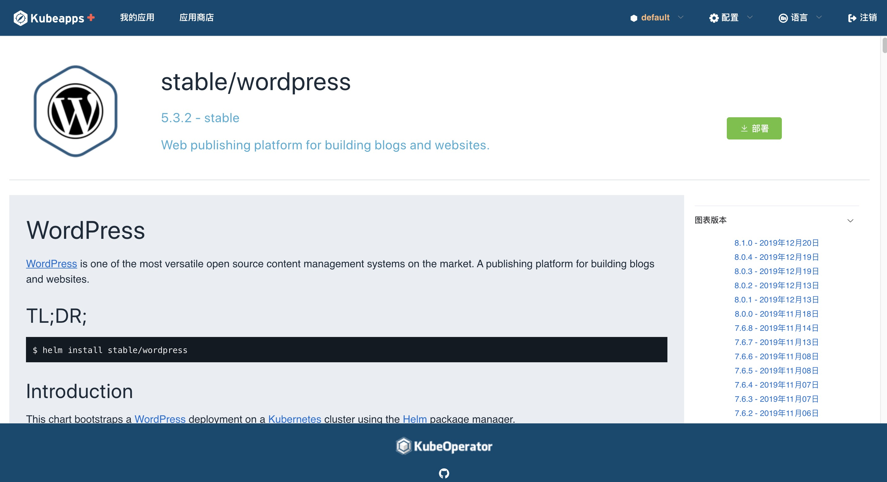
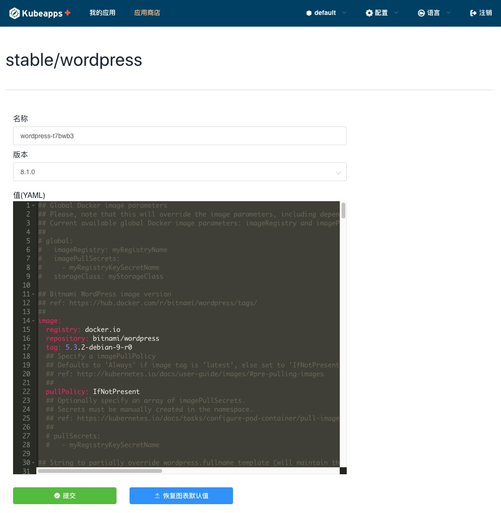
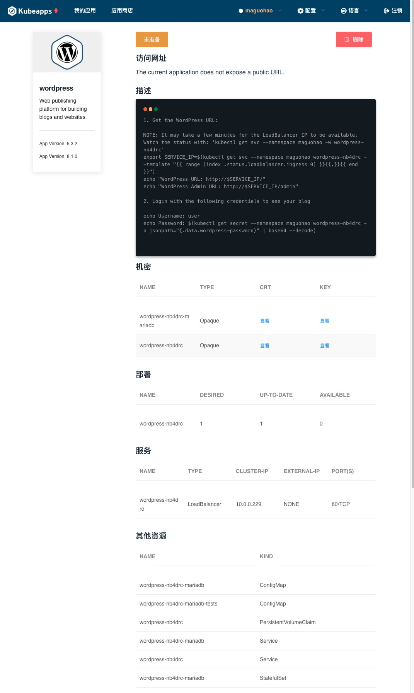

# Kubeapps Plus入门

本指南将引导您完成为集群部署Kubeapps Plus并安装示例应用程序的过程。

## 先决条件

Kubeapps Plus假设您的Kubernetes集群(v1.8 +)，安装在集群中的[`Helm`](https://helm.sh/)(2.14.0+)和[`kubectl`](https：// kubernetes.io/docs/tasks/tools/install-kubectl/)已安装并配置为与Kubernetes集群通信。 Kubeapps Plus已通过Azure Kubernetes服务(AKS)，Google Kubernetes引擎(GKE)，`minikube`和用于桌面Kubernetes的Docker进行了测试。 Kubeapps Plus可在启用RBAC的群集上运行，建议使用此配置以实现更安全的安装。

> 在GKE上，您必须是“ Owner”或具有“ Container Engine Admin”角色才能安装Kubeapps Plus。

## Step 1: 安装Kubeapps Plus

使用Helm图表安装最新版本的Kubeapps Plus：

```bash
helm repo add bitnami https://charts.bitnami.com/bitnami
helm install --name kubeapps-plus --namespace kubeapps-plus bitnami/kubeapps
```

有关安装，配置和升级Kubeapps Plus的详细信息，请签出[图表自述文件](../../chart/kubeapps/README.md)。

上面的命令会将Kubeapps Plus部署到集群中的`kubeapps`名称空间中。 执行可能需要几分钟。 部署完成并且Kubeapps Plus容器运行后，继续执行步骤2。

## Step 2: 创建一个Kubernetes API令牌

访问仪表盘需要Kubernetes API令牌才能通过Kubernetes API服务器进行身份验证。

```bash
kubectl create serviceaccount kubeapps-operator
kubectl create clusterrolebinding kubeapps-operator --clusterrole=cluster-admin --serviceaccount=default:kubeapps-operator
```

> **NOTE** 不建议为Kubeapps Plus生产用途创建`cluster-admin`用户。 请参考[访问控制](/docs/user/access-control.md)文档，为用户配置细粒度的访问控制。

要检索令牌，

### On Linux/macOS:

```bash
kubectl get secret $(kubectl get serviceaccount kubeapps-operator -o jsonpath='{range .secrets[*]}{.name}{"\n"}{end}' | grep kubeapps-operator-token) -o jsonpath='{.data.token}' -o go-template='{{.data.token | base64decode}}' && echo
```

### On Windows:

Create a file called `GetDashToken.cmd` with the following lines in it:

```bat
@ECHO OFF
REM Get the Service Account
kubectl get serviceaccount kubeapps-operator -o jsonpath={.secrets[].name} > s.txt
SET/p ks=<s.txt
DEL s.txt

REM Get the Base64 encoded token
kubectl get secret %ks% -o jsonpath={.data.token} > b64.txt

REM Decode The Token
DEL token.txt
certutil -decode b64.txt token.txt
```

打开命令提示符并运行`GetDashToken.cmd`您的令牌可以在`token.txt`文件中找到。

## Step 3: 启动Kubeapps Plus仪表板

安装Kubeapps Plus后，请运行以下命令从系统安全地访问Kubeapps Plus仪表板：

```bash
export POD_NAME=$(kubectl get pods -n kubeapps -l "app=kubeapps,release=kubeapps" -o jsonpath="{.items[0].metadata.name}")
echo "Visit http://127.0.0.1:8080 in your browser to access the Kubeapps Plus Dashboard"
kubectl port-forward -n kubeapps $POD_NAME 8080:8080
```

这将启动HTTP代理，以安全地访问Kubeapps Plus仪表板。 在您喜欢的网络浏览器中访问http://127.0.0.1:8080/以打开仪表板。 这是您应该看到的：



粘贴上一步中生成的令牌以认证和访问Kubernetes的Kubeapps Plus仪表板。


## Step 4: 部署WordPress

一旦Kubeapps Plus仪表板启动并运行，就可以开始将应用程序部署到群集中。

- 使用仪表板中的“目录”页面从任何已配置的Helm图表存储库中的图表列表中选择一个应用程序。 本示例假定您要部署WordPress。

  

- 单击“使用头盔部署”按钮。

  

- 系统将提示您输入应用程序的发行名称和值。

  

- 点击“提交”按钮。 该应用程序将被部署。 您将能够直接从浏览器跟踪新的Kubernetes部署。

  

要获取WordPress用户名和密码，请参考部署页面的“注释”部分，其中包含您需要运行以获取部署凭据的命令。

您也可以使用显示的URL直接访问应用程序。 请注意，根据您选择的云提供商的不同，访问URL可能需要一些时间才能用于应用程序，并且该服务将保持“待处理”状态，直到分配了URL。 如果使用Minikube，则需要在终端中运行“ minikube tunnel”，以便将IP地址分配给您的应用程序。


## 下一步

通过以下链接了解有关Kubeapps Plus的更多信息：

-[详细的安装说明](../../chart/kubeapps/README.md)
-[Kubeapps Plus仪表板文档](dashboard.md)
-[Kubeapps Plus组件](../architecture/overview.md)
-[路线图](https://github.com/kubeapps/kubeapps/wiki/Roadmap)
