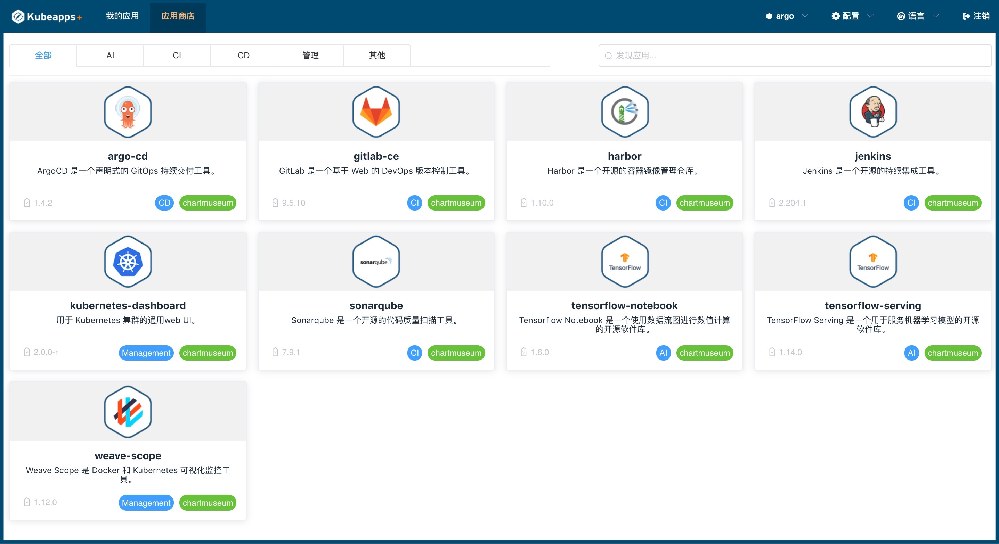

# KubeApps Plus 使用指南

本指南将引导您完成为集群部署 KubeApps Plus 并安装示例应用程序的过程。

KubeApps Plus 假设您的 Kubernetes 集群(v1.8 +), 安装在集群中的 [Helm](https://helm.sh/)(2.14.0+) 和 [kubectl](https://kubernetes.io/docs/tasks/tools/install-kubectl/)已安装并配置为与 Kubernetes 集群通信。 

KubeApps Plus 已通过 Azure Kubernetes 服务(AKS), Google Kubernetes 引擎(GKE), minikube 和用于桌面 Kubernetes 的 Docker 进行了测试。 KubeApps Plus 可在启用 RBAC 的群集上运行, 建议使用此配置以实现更安全的安装。

> 在GKE上, 您必须是 `Owner` 或具有 `Container Engine Admin` 角色才能安装 KubeApps Plus。

## Step 1: 安装 KubeApps Plus

KubeApps Plus 的安装方式有两种，一种是作为 KubeOperator 的内置应用，在 KubeOperator 里面安装 K8s 集群时作为内置应用自动安装 KubeApps plus，这里不在赘述。另外一种是使用 Helm 图表手动安装到集群。下面仅简单介绍手动安装方法。

> 注：目前仅 K8s 1.16.4 以上版本支持 KubeApps Plus。

```bash 
# 登录 K8s 集群的 master 节点
git clone https://github.com/KubeOperator/kubeapps-plus.git
cd kubeapps-plus
helm install --name kubeapps-plus --namespace kubeapps-plus ./chart
```

上面的命令会将 KubeApps Plus 部署到集群中的 `kubeapps-plus` 命名空间中，该安装过程可能需要几分钟。后面章节详述怎样登录 KubeApps Plus Web UI。 

### 安装 Helm Charts 离线包

Helm Chart 离线包包括两个离线包，一个是 CI 相关的应用包括 Gitlab、Harbor、Jenkins 和 Sonarqube，另外一个是 AI 机器学习应用包括 Tensorflow-notebook 和 Tensorflow-serving，用户可以根据需要下载并安装。
请自行下载 Chart 离线包，并复制到目标机器的 /tmp 目录下。

- 下载链接: https://github.com/KubeOperator/KubeOperator/releases

默认使用本地 ChartMuseum 仓库，如果需要修改仓库地址，请修改 kubeappsctl.sh 文件里的 repo_url、repo_username、repo_password 等参数。
安装过程中需要手动输入的信息，选择默认值，即选择不使用外部 Docker Image registry 和不使用外部 Chart 仓库。

#### 安装步骤:

```bash
# 首先登录 master 节点，其次进入 tmp (或其他自定义)目录
cd /tmp
wget http://xxx.xxx.xxx.xxx/kubeapps-plus/kubeapps-plus-package-v1.0-CI-xx.tar.gz
# 解压文件到本目录
tar zxvf kubeapps-plus-package-v1.0-CI-xx.tar.gz
# 解压后会出现一个 kubeapps-plus-CI 目录
cd kubeapps-plus-CI
# 执行 kubeappsctl.sh shell 文件,将会下载镜像并推送到本地(或自定义)仓库
./kubeappsctl.sh start
```

安装完成后，大概十分钟后，以上仓库中应用会更新到 KubeApps Plus 的应用商店中。

安装 KubeApps Plus 后, 在 KubeOperator 集群概览页获取 TOKEN ，保证将内置应用 KubeApps Plus web url 添加到本地 host 文件中。

 在 KubeOperator 集群【内置应用】页，单击 KubeApps 链接，可以安全地访问 KubeApps Plus 仪表板。


粘贴上一步中生成的令牌以认证和访问 Kubernetes 的 KubeApps Plus 仪表板。


## Step 4: 部署应用

登录 KubeApps Plus 仪表板后, 就可以开始将应用程序部署到集群中。

在仪表板中的【应用商店】页中可以看到系统默认自带的六个应用，可选择一个应用程序部署。 本文以部署 Gitlab 应用为例说明。

  

首选根据用户需要选择一个 namespace，这里选择 kube-system namespace，然后单击部署应用，可以看到【应用商店】里面目前支持的应用列表。选择 gitlab 应用后,在应用页面右侧单击 “部署” 按钮。

  

系统将提示输入应用程序的名称，还可以看到目前版本，以及 gitlab 应用 YAML 配置文件，用户可根据自身需求修改配置文件。

  

在最下面点击“提交”按钮。 该应用程序将被部署。 部署成功后，应用变为就绪状态。

  

要获取 gitlab 用户名和密码, 请参考部署页面的 “描述” 部分, 其中包含 gitlab 的 url、账号及密码信息。注意要将 该 url 添加到本地 host 解析。

这样即可以使用该 URL 直接访问应用程序。 


## Step 5: 删除应用

部署完成的应用如果要删除，可以在【我的应用】进入 Gitlab 应用后，单击右侧 “删除” 按钮确定即可删除。


## Step 6: 添加存储库

KubeApps Plus 支持添加外部应用仓库，在【配置】下拉菜单“应用存储库“页面，单击“添加应用仓库”。


输入仓库名称和网址，提交后在应用商店页使用新添加仓库里面的应用。


## Step 7: 更新命名空间

如果在 K8s 集群中用户新建了 namespace, KubeApps Plus web 端需要手动更新 namespace, 即在首页【配置】下拉菜单“更新命名空间”


更新成功后，在 namespace 列表中可以看到集群中所有的 namespace。


> 注：kube-operator 和 kubeapps-plus namespace 是 KubeOperator 系统安装内置应用使用的，仅支持查看应用，不能部署新应用和删除已有应用。

通过以下链接了解有关 KubeApps Plus 的更多信息: 

- [KubeApps Plus安装指南](../../chart/README.md);
- [KubeApps Plus仪表板](dashboard/README.md);
- [KubeApps Plus架构说明](../architecture/overview.md);
